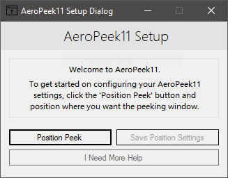

# 🗔 AeroPeek11
Bring back the Aero Peek feature into Windows 11.

# ⁉️ What's AeroPeek11 Do?
AeroPeek11 allows you to bring back the Windows Aero Peek feature that was stripped from Windows 11. Why was it stripped? We don't know. Thankfully, an un-documented API call allows you to invoke Aero Peek and bring back it's functionality. With some hacky work and lots of time, you can create a program to simulate Aero Peek fully.

AeroPeek11 creates a window or "Form" that you manually place in the old Aero Peek position. Once placed, the program can be restarted and the "Form" will be loaded again in that spot that you told it to stay. When you hover over the "Form", an event handler for entering the "Form" will be triggered and will simulate Aero Peek functionality.

# ✔️ Download AeroPeek11
You can easily compile AeroPeek11 yourself, or, you can download the pre-compiled binary for Windows. AeroPeek11 doesn't check your Windows system so if you really want to use it on Windows 10, go ahead.

[Download AeroPeek11](https://github.com/noahlbartley/AeroPeek11/releases)

# ✨ AeroPeek11 Features
AeroPeek11 is a small and compact program but it packs-a-punch. It may not have many options but it does it's job well. A few things AeroPeek11 does good is:

- Simulating the Aero Peek feature. With the delay before peek and return to programs view.
- Simple and straight to the point. Open the program, configure position, save position, done.
- Easy to follow and easy to use design.
- Effective error reporting without sending data. Show an error report to you and let you choose to make a report on the repository manually.
- Privacy focused program. No tracking or anything. No version reporting or bug reporting. You choose to make reports and you choose what is sent.

# ⛔ Report Bugs
AeroPeek11 respects your privacy. AeroPeek11 does not include an error reporter in the program. To report an error, select 'Yes' on the show error report dialog. This will show some error information. Write down specific parts that seem useful. An example is the error telling you what line of code the error appeared on.

Once finished, head to this repository and make an issue. Describe the issue and what's happening. Describe the version of AeroPeek11 and the version of Windows 11 you're using.

That's it. No need for special bug reporting. Manual bug reporting without hassle.
